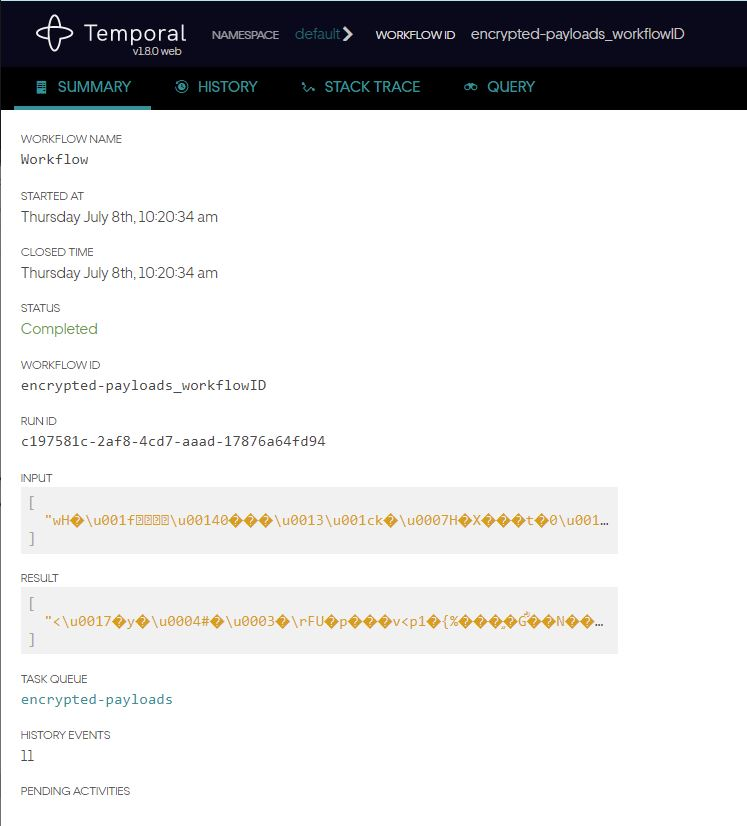

### Steps to run this sample:
1) You need a Temporal service running. See details in README.md
2) Run the following command to start the worker
```
go run worker/main.go
```
3) Run the following command to start the example
```
go run starter/main.go
```

This project is based on the [temporalio sample encrypted-payloads](https://github.com/temporalio/samples-go/tree/master/encrypted-payloads).  

The difference here is that the arguments passed to the Workflows and Activities are pointers to a struct.  The stuct must contain an embedded field called **ProtectMe**.  

```go
type ProtectMe struct {
}
type SensitivePayload struct {
	ProtectMe *ProtectMe
	Secret    string
}
```  
Workflow and actvity funcs look like the following;  

```go
func Workflow(ctx workflow.Context, in *SensitivePayload) (*SensitivePayload, error) 
func Activity(ctx context.Context, in *SensitivePayload) (*SensitivePayload, error)
```  
Its a nice way to protect data simply by tagging it.  

### Protoc Example
In my case a lot of the structs are generated from a proto file, hence the ```ProtectMe *ProtectMe``` way of embedding.  

```proto
message ProtectMe{}
// The request message containing the user's name.
message HelloRequest {
  ProtectMe ProtectMe = 1;
  string name = 2;
}
```

produces  

```go
type HelloRequest struct {
	state         protoimpl.MessageState
	sizeCache     protoimpl.SizeCache
	unknownFields protoimpl.UnknownFields

	ProtectMe *ProtectMe `protobuf:"bytes,1,opt,name=ProtectMe,proto3" json:"ProtectMe,omitempty"`
	Name      string     `protobuf:"bytes,2,opt,name=name,proto3" json:"name,omitempty"`
}
```  


